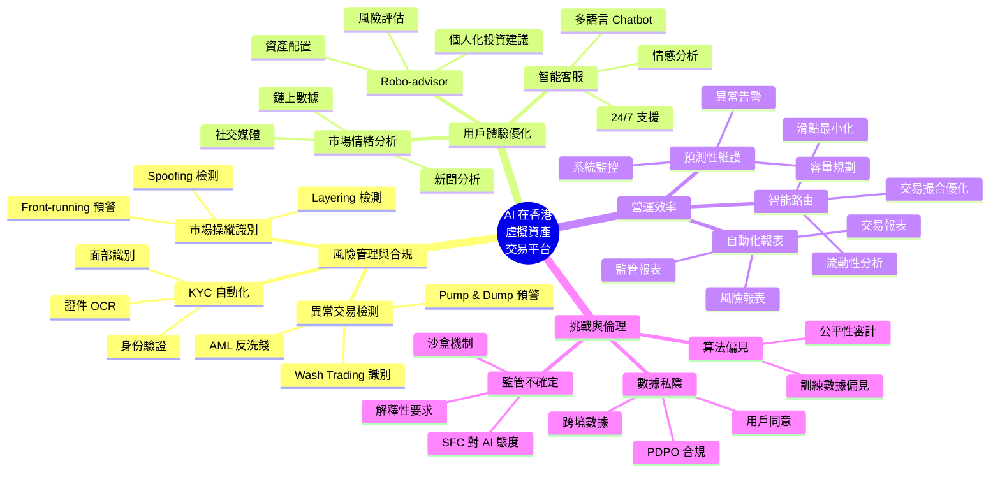

# AI Use-Case Mindmap — 香港虛擬資產交易平台

> **Week 9 COMP5511 | 主題 A：AI 在香港虛擬資產交易平台的應用**
> **生成日期：2026年6月**

---

## Mermaid Mindmap（可直接喺 GitHub 顯示）

---

## 5 大 Use Cases 詳細分析

### 1. AML / KYC 自動化

| 項目 | 內容 |
|------|------|
| **應用** | 實時交易監控 + 身份驗證 |
| **AI 技術** | NLP + 異常檢測 + 計算機視覺 |
| **效益** | 99% 準確率、人工成本降 70% |
| **案例** | HashKey 採用 Onfido、Sumsub |
| **挑戰** | 私隱 + 跨境數據 + 偏見 |

### 2. Robo-advisor 個人化

| 項目 | 內容 |
|------|------|
| **應用** | 個人化投資組合 + 風險評估 |
| **AI 技術** | 強化學習 + 優化算法 |
| **效益** | 服務下沉 + 成本降 80% |
| **案例** | Endowus、StashAway 香港版 |
| **挑戰** | 信任 + 監管 + 表現 |

### 3. Algorithmic Trading

| 項目 | 內容 |
|------|------|
| **應用** | ICT Smart Money + AI 自動執行 |
| **AI 技術** | 時序預測 + 強化學習 + NLP |
| **效益** | 速度 + 紀律 + 24/7 |
| **案例** | OpenClaw AI Trading Agent |
| **挑戰** | 透明度 + 系統性風險 + 監管 |

### 4. Chatbot 智能客服

| 項目 | 內容 |
|------|------|
| **應用** | 24/7 多語言客戶服務 |
| **AI 技術** | LLM + RAG + 語音識別 |
| **效益** | 回應時間 5 分鐘 → 30 秒 |
| **案例** | ZA Bank 客服、HSBC Chatbot |
| **挑戰** | 複雜問題 + 情感 + 私隱 |

### 5. Smart Contract Audit

| 項目 | 內容 |
|------|------|
| **應用** | 自動檢測漏洞 + 安全審計 |
| **AI 技術** | 靜態分析 + 模式識別 + LLM |
| **效益** | 速度 + 覆蓋 + 準確度 |
| **案例** | CertiK、OpenZeppelin Defender |
| **挑戰** | 新型攻擊 + 形式化驗證 |

---

## AI Use Case 優先級矩陣

| Use Case | 影響 | 難度 | 優先級 |
|----------|------|------|--------|
| **AML/KYC** | 高 | 中 | ⭐⭐⭐⭐⭐ |
| **Algorithmic Trading** | 高 | 高 | ⭐⭐⭐⭐ |
| **Robo-advisor** | 中 | 中 | ⭐⭐⭐ |
| **Chatbot** | 中 | 低 | ⭐⭐⭐ |
| **Smart Contract Audit** | 中 | 中 | ⭐⭐⭐ |

---

## 香港 Web3 平台 AI 採用路線圖

### Phase 1（0-6 個月）：基礎建設
- KYC 自動化
- Chatbot 客服
- 交易監控

### Phase 2（6-12 個月）：用戶體驗
- Robo-advisor
- 個人化推薦
- 市場情緒分析

### Phase 3（12-18 個月）：進階功能
- Algorithmic Trading
- Smart Contract Audit
- DAO 治理輔助

### Phase 4（18+ 個月）：前沿應用
- AI 預測市場
- 去中心化 AI
- AI 代理經濟

---

## 與 Capstone Paper 嘅具體連結

呢個 Mindmap 直接應用於 **AF5944 Research Project**：

1. **OpenClaw AI Trading Agent** = Algorithmic Trading Use Case
2. **ICT Smart Money Concepts** = 規則 + AI 混合
3. **香港 Web3 市場** = Phase 1-3 採用路線圖
4. **AI 倫理** = 挑戰與倫理部分

---

## 📝 Mindmap 製作方法

Yip 可選擇以下工具製作：
- **draw.io** (https://app.diagrams.net/) — 免費 + 開源
- **Miro** (https://miro.com/) — 協作
- **PowerPoint** — 簡單直接
- **Xmind** — 專業 mindmap
- **Markdown Mermaid** — 純文字（已用呢個）

---

*Reference: 3個月速成 PolyU MSc 自學計劃 — Week 9 COMP5511 Mindmap*
