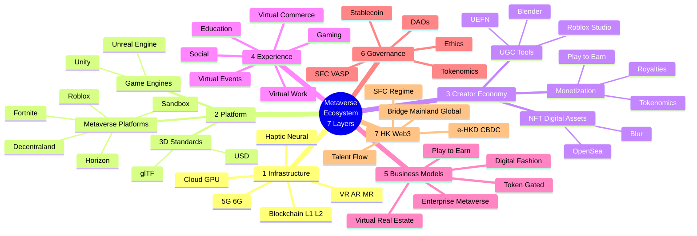

# Metaverse Ecosystem Mindmap (Jon Radoff 7-Layer Framework)

> **PolyU AF5640 | Week 10 | 2026年6月**
> **基於 Jon Radoff "Building the Metaverse" 7-Layer 框架 + Hong Kong/Web3 視角**

---

## Jon Radoff 7 大層級

### 1. Infrastructure Layer（基礎設施層）
- **網絡：** 5G / 6G、低延遲 Edge Computing
- **雲端：** Cloud Computing、GPU、TPU
- **硬件：** VR / AR / MR Devices、Haptic（觸覺）、Neural（腦機接口）
- **區塊鏈：** Layer 1（Ethereum、Solana）、Layer 2（Polygon、Arbitrum）

### 2. Platform & Spatial Computing Layer（平台層）
- **遊戲引擎：** Unity、Unreal Engine
- **Metaverse 平台：** Decentraland、The Sandbox、Roblox、Horizon Worlds
- **3D 標準：** glTF、USD、OpenXR
- **空間運算：** Apple Vision Pro、Snap Spectacles

### 3. Creator Economy Layer（創作者經濟層）
- **NFT + 數字資產：** OpenSea、Blur、Tensor
- **UGC 工具：** Roblox Studio、UEFN、Blender
- **變現模式：** Royalties、Tokenomics、Play-to-Earn
- **創作者平台：** Patreon、Substack

### 4. Experience Layer（體驗層）
- **Gaming & Entertainment：** Fortnite、Roblox、Decentraland
- **Social & Virtual Events：** VRChat、Horizon Worlds、Spatial
- **Virtual Work & Education：** ENGAGE、Microsoft Mesh
- **Virtual Commerce：** Nike Nikeland、Gucci Garden、Balenciaga

### 5. Economy & Business Models（經濟 + 商業模式）
- **Play-to-Earn / Play-to-Own**（Axie Infinity 模式）
- **Virtual Real Estate**（Sandbox LAND、Decentraland）
- **Digital Fashion & Virtual Goods**（RTFKT、DressX）
- **Brand Experiences & Token-Gated Commerce**
- **Enterprise Metaverse**（Accenture、培訓、虛擬總部）

### 6. Governance, Regulation & Ethics（治理 + 監管 + 倫理）
- **DAOs & Decentralized Governance**
- **Tokenomics Design**
- **Regulatory Frameworks：** SFC VASP、穩定幣條例
- **Ethical Issues：** Privacy、Addiction、Inequality

### 7. Hong Kong / Web3 Angle（香港 + Web3 視角）
- **SFC Virtual Asset Trading Platform Regime**
- **e-HKD CBDC 試驗**
- **人才與資本流動**
- **作為「內地 + 全球」Metaverse 橋樑的機會**

---

## Mermaid Mindmap（GitHub 自動渲染）

---

## Brookings "Metaverse Economics Part 1" 重點（Korinek 2023）

### 核心論點

1. **Metaverse 是一個新嘅經濟前沿**
2. **價值創造 4 大來源：**
   - 新嘅消費體驗
   - 降低交易成本
   - 創造新市場
   - 重塑工作模式

3. **5 大經濟活動：**
   - 沉浸式娛樂
   - 沉浸式商務
   - 沉浸式學習
   - 沉浸式工作
   - 沉浸式社交

4. **3 大政策挑戰：**
   - 私隱 + 數據保護
   - 公平 + 包容性
   - 監管 + 國際協調

### 對香港嘅啟示

- 香港有 Animoca Brands 龍頭企業
- SFC 監管框架已成型（VASP + 穩定幣）
- 可成為「內地 + 全球」Metaverse 橋樑

---

## Cathy Hackl 4 大商業模式（深化）

### 1. 沉浸式商務（Immersive Commerce）
- **Nike Nikeland on Roblox：** 700 萬+ 訪客
- **Gucci Garden on Roblox：** 限量 NFT 銷售
- **Balenciaga Fortnite：** 虛擬時尚
- **預計 2030 年市場：** US$2,000 億

### 2. 沉浸式娛樂（Immersive Entertainment）
- **Travis Scott Fortnite：** 12.3M 觀眾
- **Ariana Grande Fortnite：** 78M 觀看
- **Decentraland Metaverse Festival：** 50+ 表演
- **預計 2030 年市場：** US$1,000 億+

### 3. 沉浸式學習（Immersive Learning）
- **ENGAGE XR：** 企業 VR 培訓
- **Spatial：** 虛擬會議 + 學習
- **Osso VR：** 外科手術培訓
- **預計 2030 年市場：** US$500 億

### 4. 沉浸式工作（Immersive Work）
- **Meta Horizon Workrooms：** 企業版
- **Microsoft Mesh：** Office + Teams 整合
- **Accenture：** 60,000 個 VR 頭盔
- **預計 2030 年市場：** US$1,500 億

---

## 香港 + Web3 視角（Layer 7 重點）

### 7.1 監管框架
- **SFC VASP 牌照**（2023 生效）
- **穩定幣條例**（2025 生效）
- **e-HKD 試驗**（2024-2025）
- **沙盒機制**（Fintech）

### 7.2 人才與資本
- **Animoca Brands** 估值 US$50 億
- **本地 startup 數量：** 600+ Web3 公司
- **政府基金：** ITF HK$200 億
- **InnoHK：** 28 個研發中心

### 7.3 區位優勢
- **「一國兩制」：** 內地市場 + 國際規則
- **普通法：** 知識產權 + 商業法
- **金融中心：** US$4.5 萬億資產管理
- **Web3 政策友善：** VASP + 現貨 ETF + 穩定幣

### 7.4 4 大機會
1. **內地 + 國際 Metaverse 橋樑**
2. **Web3 + 創作者經濟龍頭**
3. **沉浸式金融（DeFi + Metaverse）**
4. **NFT + 虛擬資產中心**

---

## 5 大香港 Metaverse 案例

| 案例 | 公司 | 描述 | 影響 |
|------|------|------|------|
| **Sandbox** | Animoca Brands | 虛擬土地 + 遊戲 | US$50 億估值 |
| **Decentraland** | Dec. Foundation | 虛擬總部 | HSBC 進駐 |
| **Roblox HK** | Roblox Corp | 港區 UGC | 70M+ 月活 |
| **VRChat HK** | VRChat Inc | 港人社群 | 25M 全球 |
| **ENGAGE HK** | ENGAGE XR | 企業 VR 培訓 | 港府使用 |

---

## 與 Capstone Paper 連結

呢個 7-Layer Mindmap 直接應用於 **AF5944**：

1. **Layer 1 基礎設施：** OpenClaw 部署 + GPU 雲端
2. **Layer 2 平台：** ICT Smart Money + AI Trading
3. **Layer 3 創作者經濟：** Trading Agent 開源策略
4. **Layer 4 體驗：** Trading Dashboard V2 沉浸式 UI
5. **Layer 5 商業模式：** OpenClaw + Subscription + Token
6. **Layer 6 治理：** 算法透明 + AI 倫理
7. **Layer 7 HK：** 香港 Web3 + Metaverse 樞紐

---

## 必記關鍵詞

- Metaverse
- Jon Radoff 7-Layer Framework
- Cathy Hackl 4 大商業模式
- Matthew Ball 7 大元素
- UGC / Creator Economy
- Roblox / Fortnite / Decentraland / Sandbox
- VR / AR / MR / XR
- Play-to-Earn
- Virtual Real Estate
- Token-Gated Commerce
- Animoca Brands
- e-HKD / CBDC
- SFC VASP
- Tokenomics
- DAO

---

## 📚 Resources

- Brookings Korinek 2023: https://www.brookings.edu/articles/metaverse-economics-part-1/
- Cathy Hackl: https://www.cathyhackl.com/
- Jon Radoff: https://medium.com/@jradoff
- Matthew Ball: https://www.matthewball.vc/
- Roblox: https://www.roblox.com/
- Decentraland: https://decentraland.org/
- Sandbox: https://www.sandbox.game/
- Animoca Brands: https://www.animocabrands.com/
- Meta Horizon: https://www.meta.com/horizon/

---

*Reference: 3個月速成 PolyU MSc 自學計劃 — Week 10 AF5640*
