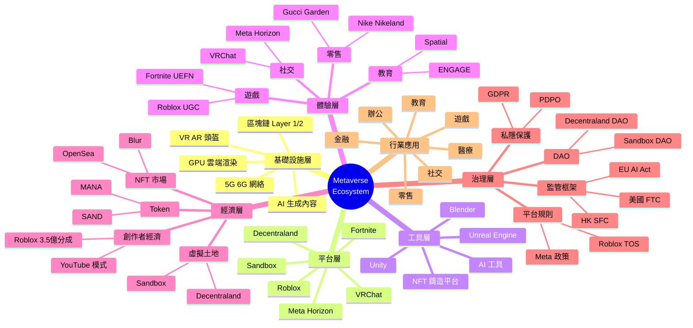

# Metaverse Ecosystem Mindmap

> **PolyU AF5640 | Week 10 | 2026年6月**

---

## Mermaid Mindmap（GitHub 自動渲染）



---

## 6 大層級詳細分析

### Layer 1: 基礎設施層（Infrastructure）

| 元素 | 描述 | 主要供應商 |
|------|------|----------|
| **5G/6G** | 低延遲網絡 | 中國移動、CSL、3HK |
| **GPU** | 圖形處理 | NVIDIA、AMD、Intel |
| **雲端渲染** | Cloud XR | AWS、Azure、阿里雲 |
| **VR/AR 頭盔** | 沉浸式設備 | Meta、Apple、Sony |
| **區塊鏈** | 資產登記 | Ethereum、Solana、Polygon |
| **AI** | 內容生成 | OpenAI、Anthropic、Midjourney |

### Layer 2: 平台層（Platforms）

| 平台 | 類型 | 月活 | 商業模式 |
|------|------|------|----------|
| **Roblox** | UGC 遊戲 | 70M+ | 虛擬商品 + 開發者分成 |
| **Fortnite** | UGC 射擊 | 80M+ | Battle Pass + 皮膚 |
| **Meta Horizon** | VR 社交 | 10M+ | 訂閱 + 虛擬商品 |
| **Decentraland** | 虛擬世界 | 500K+ | 虛擬土地 + NFT |
| **Sandbox** | 虛擬世界 | 300K+ | 虛擬土地 + SAND |
| **VRChat** | 社交 VR | 25M+ | 免費 + 訂閱 |

### Layer 3: 工具層（Tools）

| 工具 | 用途 | 價錢 |
|------|------|------|
| **Unity** | 遊戲引擎 | 免費 + Pro |
| **Unreal Engine** | 高端 3D | 免費 + Royalty |
| **Blender** | 3D 建模 | 開源 |
| **Midjourney** | AI 圖像 | US$10-60/月 |
| **RunwayML** | AI 視頻 | US$15-95/月 |

### Layer 4: 體驗層（Experiences）

| 類別 | 例子 | 觸及 |
|------|------|------|
| **遊戲** | Roblox 遊戲、Fortnite UEFN | 數億 |
| **社交** | Meta Horizon、VRChat | 數千萬 |
| **教育** | ENGAGE、Spatial | 數百萬 |
| **零售** | Nike Nikeland、Gucci Garden | 數千萬 |
| **演唱會** | Travis Scott、Ariana Grande | 數千萬 |
| **會議** | Microsoft Mesh | 數百萬 |

### Layer 5: 經濟層（Economy）

| 元素 | 規模（2025）| 增長 |
|------|-----------|------|
| **NFT 市場** | US$30 億 | 穩定 |
| **虛擬土地** | US$10 億 | 復蘇中 |
| **Roblox 開發者** | US$3.5 億分成 | +20% |
| **SAND Token** | 市值 US$____ | 波動 |
| **MANA Token** | 市值 US$____ | 波動 |

### Layer 6: 治理層（Governance）

| 元素 | 機構 | 工具 |
|------|------|------|
| **DAO** | Decentraland、Sandbox | 投票 + 國庫 |
| **平台規則** | Roblox、Meta | ToS + 內容政策 |
| **監管** | SFC、FTC、EU | 牌照 + 罰款 |
| **私隱** | PCPD、GDPR Council | 條例 + 執法 |

---

## 香港 Metaverse 生態

```
香港 Metaverse
├── 龍頭企業
│ ├── Animoca Brands（Sandbox 母公司）
│ ├── 數碼港（培育）
│ └── Cyberport（Web3 Hub）
├── 大學
│ ├── HKU（Metaverse 課程）
│ ├── PolyU（Digital Economics）
│ └── HKUST（AI + Web3）
├── 政府
│ ├── 智慧城市藍圖
│ ├── 創新及科技基金
│ └── VASP 牌照
└── 應用
  ├── 演唱會
  ├── 教育
  ├── 金融
  └── 零售
```

---

## 7 大香港 Metaverse 應用案例

| 案例 | 公司 | 描述 |
|------|------|------|
| **Sandbox** | Animoca Brands | 虛擬土地 + 遊戲 |
| **Decentraland** | Dec. Foundation | 虛擬總部 + 展覽 |
| **Roblox HK** | Roblox Corp | 港區 UGC 遊戲 |
| **VRChat HK** | VRChat Inc | 港人社群 |
| **ENGAGE** | ENGAGE XR | 企業培訓 |
| **Spatial** | Spatial Labs | 虛擬會議 |
| **The Sandbox HK** | Animoca | 香港文化展覽 |

---

## 與 Capstone Paper 連結

呢個 Mindmap 直接應用於 **AF5944**：

1. **Metaverse + Trading：** 沉浸式金融交易
2. **Animoca Brands 案例：** 香港 Web3 龍頭
3. **虛擬資產經濟：** NFT + 虛擬土地
4. **創作者經濟：** 平台經濟延伸
5. **沉浸式商務：** Nike Nikeland 案例
6. **香港動漫：** 結合香港文化

---

*Reference: 3個月速成 PolyU MSc 自學計劃 — Week 10 AF5640 Mindmap*
